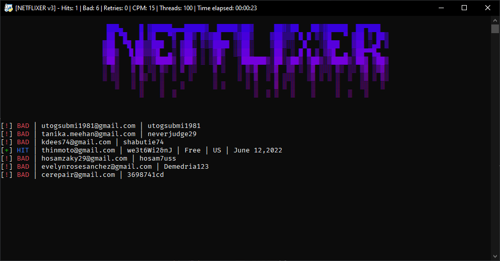

<p align="center">
  
  
  
  
  
</p>
  
---------------------------------------
  
<div align="center">
  <a href="https://github.com/kimberlyggm9am8/Netflix-Combo-Checker">
    
  </a>
  

  <p align="center">
    <br />
    <a href="https://github.com/kimberlyggm9am8/Netflix-Combo-Checker/issues">Report Bug</a>
    |
    <a href="https://github.com/kimberlyggm9am8/Netflix-Combo-Checker/issues">Request Feature</a>
  </p>
</div>

---------------------------------------
### 🛠 Setting-up

```
git clone https://github.com/kimberlyggm9am8/Netflix-Combo-Checker
cd Netflix-Combo-Checker
pip install -r requirements.txt
python main.py
```
---------------------------------------

### 🏆 Features 
- Ultra fast hits.
- Custom algorithm to minimise cpu usage. 
- Proxy support (HTTPS, SOCKS4, SOCKS5).
- High CPM.
- Save hits to file.
---------------------------------------

> **Warning**
> I'm not held responsible for any actions performed while using this program.
